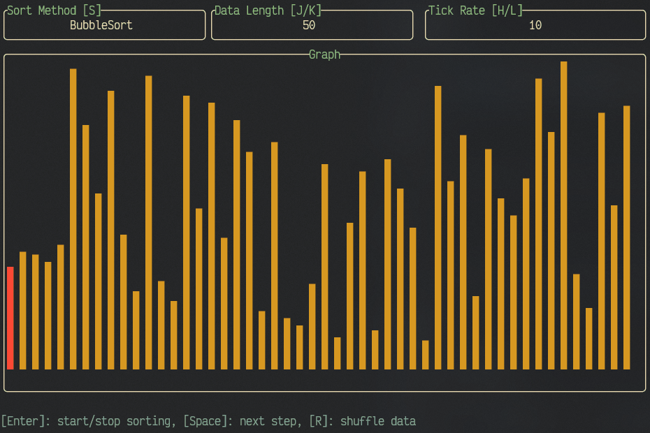

# Sortui



This is a self-learning project of visualizing sorting algorithms with terminal
user interface(tui). This application is written in Rust and
[tui-rs](https://github.com/fdehau/tui-rs) framework. I'm really enjoy building
something on terminal because I am a terminal user.

## Build

```sh
cargo build --bin sortui
```

## Run

```sh
cargo run --bin sortui
```

## Usage

`s`: select sorting algorithms

`Enter`: start auto sorting

`Space`: when no auto sorting, this perform next step in sorting algorithm

`r`: shuffle data

`j`: subtract data length

`k`: add data length

`h`: subtract auto sorting tick time

`l`: add auto sorting tick time
